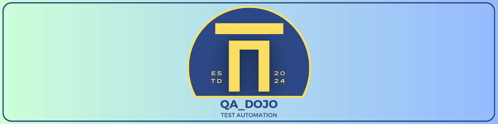

# Міні курс з JavaScript і http для самопідготовки

## Зміст

- [Урок 1: Вступ](1-lesson.md)
- [Урок 2: Змінні, типи даних, умовні оператори](2-lesson.md)
- [Урок 3: Логічні оператори](3-lesson.md)
- [Урок 4: Цикли](4-lesson.md)
- [Урок 5: Функції](5-lesson.md)
- [Урок 6: Об'єкти](6-lesson.md)
- [Урок 7: Масиви](7-lesson.md)
- [Урок 8: Основи HTTP та API](8-lesson.md)
